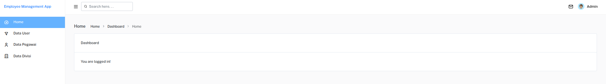
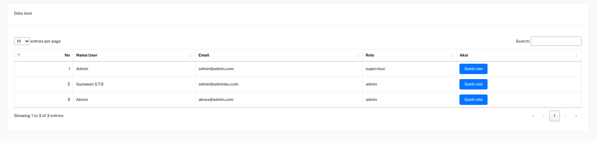
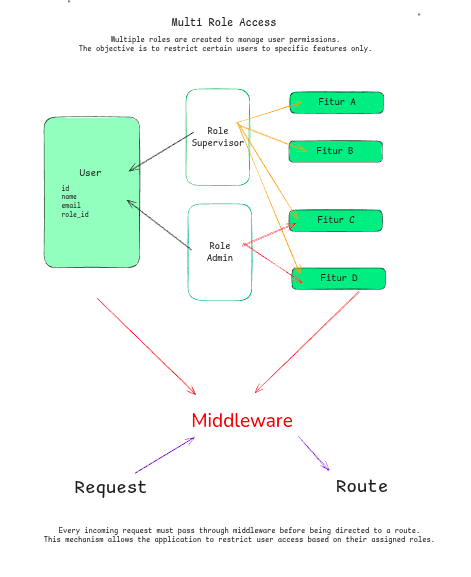
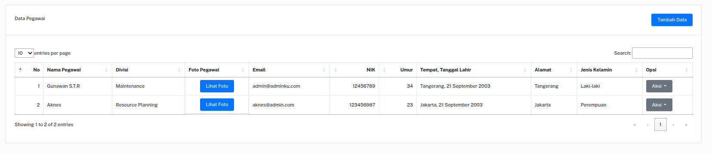
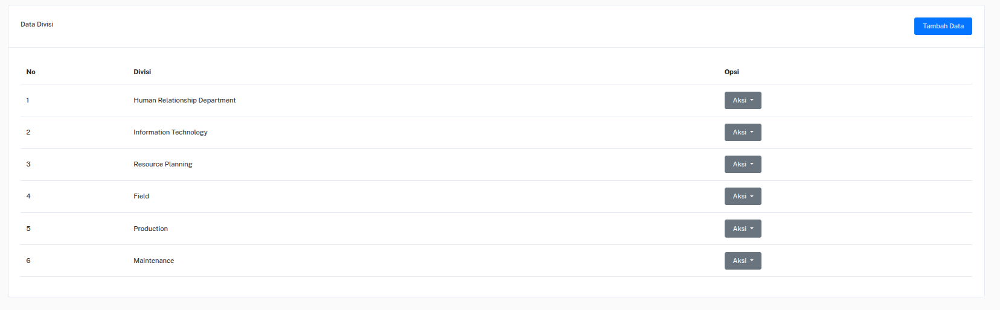
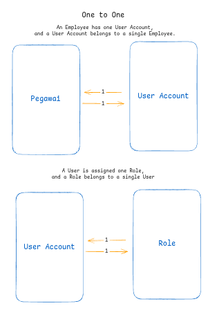
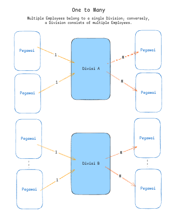

# Management User App (ManEmp)

This project is a simple Laravel application built for learning and practicing the Laravel framework. It focuses on comprehensive CRUD operations, database management using Docker, and role-based access control.

---

## Tech Stack

**Backend & Framework:**
* [Laravel 12](https://laravel.com)
* MySQL Database (via Docker)

**Frontend:**
* Bootstrap 5
* [Mantis Template](https://themewagon.com/themes/mantis/) (ThemeWagon)

**Tools & Libraries:**
* Docker & Docker Compose (for Database & phpMyAdmin)
* [Laravel SweetAlert](https://realrashid.github.io/sweet-alert/) by RealRashid

---

## Features

1.  **Dashboard**: Overview of application statistics.

2.  **User Management**:

    * Role-based access control using Middleware.
    * Secure authentication.
    
3.  **Employee Data (Pegawai)**:

    * Complete CRUD operations.
    * Photo upload capability.
4.  **Division Data (Divisi)**:

    * Complete CRUD operations for managing company divisions.

---

## Database Relations

The application uses the following relationship structure:

* **One to One**:
    * `Pegawai` ↔ `User Account`
    * `User Account` ↔ `Role`
    
* **One to Many**:
    * `Divisi` → `Pegawai` (One Division has many Employees)
    

---

## Installation & Setup

Follow these steps to get the project up and running in your local environment.

### 1. Initialize Project & Dependencies
First, clone the repository or create the project, then install the dependencies.

```bash
# Enter project directory
cd man-emp

# Install Backend Dependencies
composer install

# Install Frontend Dependencies
npm install
```

### 2. Database Setup (Docker)
```bash
# Start the containers in detached mode
docker compose up -d

# (Optional) If containers exist but are stopped
sudo docker start mysql-manEmp phpmyadmin
```

### 3. Run the Application
```bash
# Run Database Migrations
php artisan migrate

# Build Frontend Assets
npm run dev

# Start Local Server
php artisan serve
```

### 4. Future Development
- Unit Testing: Implement PHPUnit testing for every feature to ensure stability.
- UI/UX Improvements: Enhance the Dashboard design for better visualization.
- Responsiveness: Optimize the layout for mobile and tablet devices.

---

## License
open-sourced software under [MIT License](https://opensource.org/license/MIT)